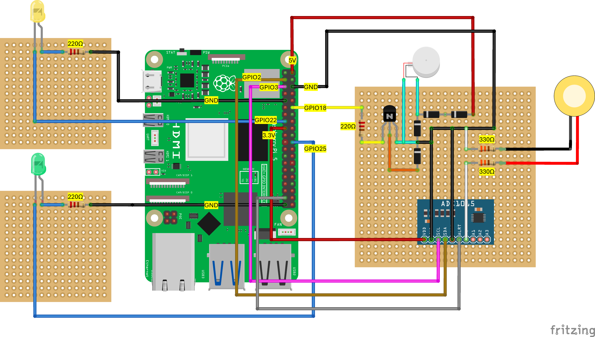

<p align="center">
  
</p>

# Haptic Ping

Haptic Ping combines table tennis shadow practice with haptic feedback to simulate a training experience that more closely resembles real play. Shadow practice is a widely used technique where table tennis players practice their strokes and form, but in the absence of a coach it can be difficult for players to know whether their position and movements are correct.

Our prototype addresses this limitation by providing real-time haptic feedback, allowing players to practice effectively without the need for a coach or any additional table tennis equipment.

Haptic Ping integrates an inertial measurement unit (IMU) and a piezo sensor mounted on the bat to monitor both orientation and physical interaction. The piezo sensor detects correct grip and handling, which triggers an LED to confirm proper finger placement. Once the correct starting position is established, a second LED illuminates to indicate the system is ready for swing analysis. The IMU then tracks the bat's motion to analyse swing patterns in real time. When a correct swing is detected, the system provides immediate haptic feedback through an eccentric rotating motor (ERM).

A project from ENG 5220 Real-Time Embedded Programming
University of Glasgow, 2026

---

## Hardware Components

| Component | Quantity | Link |
|---|---|---|
| Raspberry Pi 5 | 1× | [RS Online](https://uk.rs-online.com/web/p/raspberry-pi/0219255/) |
| ICM-20948 IMU | 1× | [RS Online](https://uk.rs-online.com/web/p/sensor-development-tools/2836590) |
| ERM Vibration Motor | 1× | [The Pi Hut](https://thepihut.com/products/vibrating-mini-motor-disc) |
| ADS1115 ADC | 1× | [The Pi Hut](https://thepihut.com/products/adafruit-ads1115-16-bit-adc) |
| Piezoelectric Sensor | 1× | [RS Online](https://uk.rs-online.com/web/p/piezo-buzzers/8377840) |
| LEDs (green) | 2× | — |
| Table Tennis Bat | 1× | — |

---

## GPIO Pin Assignments

| Signal | GPIO Pin |
|---|---|
| PWM (ERM motor) | GPIO 18 |
| IMU LED | GPIO 22 |
| Piezo LED | GPIO 25 |
| ADS1115 DRDY interrupt | GPIO 26 |
| IMU data-ready interrupt | GPIO 27 |
| I2C SDA | GPIO 2 |
| I2C SCL | GPIO 3 |

IMU I2C address: `0x69`, ADS1115 I2C address: `0x48`, I2C bus: `1`

---

## Wiring Diagram



---

## Hardware Assembly


## Prerequisites

This project runs on Linux (Raspberry Pi OS). Not compatible with Windows.

### Enable I2C
```bash
sudo raspi-config
# Navigate to: Interface Options → I2C → Enable
```

### Install dependencies
```bash
sudo apt update
sudo apt install -y libgpiod-dev libgpiod2 libi2c-dev i2c-tools libyaml-cpp-dev cmake build-essential
```

---

## Compilation from Source

```bash
git clone <repo-url>
cd RTES_Table_Tennis

# Build main application
cmake -S src -B build
cmake --build build -j$(nproc)
```

---

## Usage

```bash
sudo ./build/rtes_main
```

The system will:
1. Wait for correct grip detected by piezo sensor → **Piezo LED on**
2. Wait for correct bat starting position detected by IMU → **IMU LED on**
3. Analyse swing in real time
4. Vibrate ERM motor on correct swing detection,one short buzz indicating low level, 2 pulse buzzes for medium level, and one strong buzz for High level, in terms of speed

Press `Ctrl+C` or `SIGHUP` to stop cleanly.

---

## Running Tests

```bash
cmake -S src -B build -DBUILD_TESTS=ON
cmake --build build -j$(nproc)
ctest --test-dir build --output-on-failure
```

31 unit tests across 6 test suites covering:
- `PiezoEventDetector` — EMA filter, press/release thresholds
- `PositionDetector` — stability counter, orientation detection
- `SwingCalibrator` — bias averaging, recalibration
- `SwingDetector` — level classification, threshold boundaries
- `SwingFeedback` — PWM ramp patterns, reset callback, timeout
- `SwingProcessor` — gate logic, force/position interaction

---

## Project Structure
```
RTES_Table_Tennis/
├── src/
│   ├── main.cpp
│   ├── CMakeLists.txt
│   └── libs/
│       ├── IMU/        # ICM-20948 driver and threaded reader
│       ├── IMU_math/   # Position detection, swing analysis, calibration
│       ├── LEDs/       # GPIO-backed LED controllers
│       ├── Motor/      # Software PWM and swing feedback patterns
│       └── Piezo/      # ADS1115 ADC driver and event detector
├── test/               # GTest unit tests
└── images/
```

---

## Authors

| Name | Matric |
|---|---|
| Despina Charalambous | 2689332C |
| Najaree Janjerdsak | 2717383J |
| Natalia McCoy | 2661134M |
| Olivia Skinner | 2671612S |
| Wiktoria Smolarek | 2619869S |

---

## Version History

- **v1.0** — Final submission release
- **v0.2** — Bug fixes and optimisations
- **v0.1** — Initial release

---

## License

This project is licensed under the MIT License — see the [LICENSE](LICENSE) file for details.

---

## Acknowledgements

- [libgpiod](https://git.kernel.org/pub/scm/libs/libgpiod/libgpiod.git/)
- [yaml-cpp](https://github.com/jbeder/yaml-cpp)
- [Google Test](https://github.com/google/googletest)
- University of Glasgow ENG 5220 teaching team
