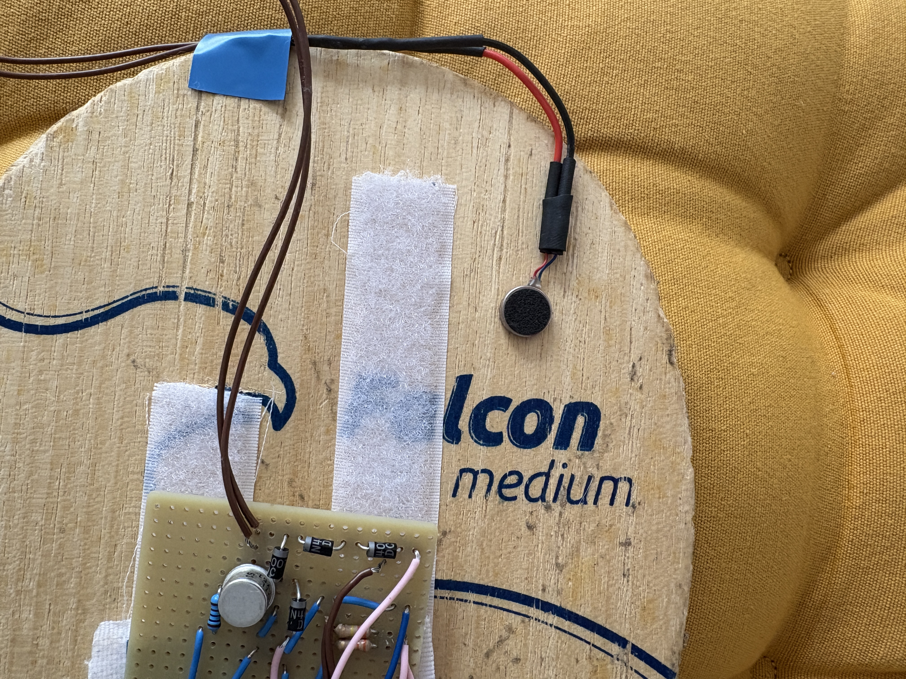

# ERM Vibration Motor

A coin-form-factor ERM (Eccentric Rotating Mass) vibration motor used to
deliver haptic feedback proportional to swing intensity.

---

## Pin Connection List

### Motor Circuit Connections

| Component        | Connection                          |
|------------------|-------------------------------------|
| Motor +          | 5V (4× AAA battery pack)            |
| Motor −          | NPN transistor collector            |
| Transistor base  | GPIO 18 via 220Ω resistor           |
| Transistor emitter | GND                               |
| Flyback diode    | Across motor terminals (GND to +)   |

---

## PWM Configuration

| Parameter      | Value         |
|----------------|---------------|
| PWM GPIO       | GPIO 18       |
| PWM Frequency  | 30 Hz         |
| Max Duty Cycle | 80%           |
| PWM Type       | Software PWM  |

> The duty cycle is capped at 80% to reduce peak back-EMF spikes.
> A ramp-up and ramp-down sequence is applied on each activation to
> spread the magnetic field build-up and collapse over ~90 ms.

---

## Motor Specifications

| Parameter         | Value                          |
|-------------------|--------------------------------|
| Operating Voltage | 2V – 5V                        |
| Dimensions        | 10mm × 2.7mm                   |
| Current at 5V     | 100 mA                         |
| Current at 4V     | 80 mA                          |
| Current at 3V     | 60 mA                          |
| Current at 2V     | 40 mA                          |
| Weight            | < 1 gram                       |

---

## Driver Circuit

The motor is driven by an NPN transistor switch controlled by the
Raspberry Pi GPIO 18 software PWM output:

- A **220Ω resistor** on the transistor base limits the base current
  from GPIO 18.
- A **flyback diode** across the motor terminals suppresses the
  back-EMF spike when the motor is switched off.
- Power is supplied by a **4× AAA battery pack (~5V)** separate from
  the Raspberry Pi supply to avoid voltage dips on the Pi rail.

---

## Hardware Assembly

